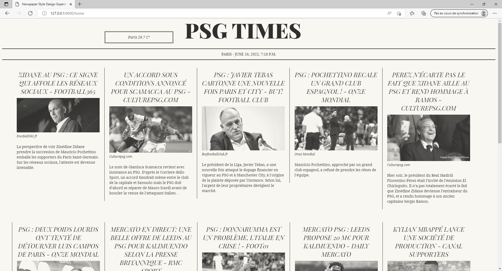

## Installation

### Environnement
```
pip install pipenv
pipenv shell
```

### Lancement 

```
git clone https://github.com/lefatoum2/Psg_news_django.git
pip install requirements.txt
cd Psg_news_django/psg_news
py manage.py makemigrations 
py manage.py migrate
py manage.py createsuperuser 

...

py manage.py runserver
```
## Utilisation de NewsApi
Inscription sur https://newsapi.org/ et obtenez votre APi Key.


3 principales URLs :

- /v2/top-headlines
- /v2/everything
- /v2/sources


#### Exemple

newstrump = ('http://newsapi.org/v2/top-headlines?    

                       q=trump& # Mot clé recherché

                       country=us& # Choix du pays

                 category=general& # catégorie

                      language=en& # langue

                pageSize=30& # Nombre max de pages

                     apiKey=Your_api_key') # API Key


##### Pour aller plus loin 

On peut mettre ses données ou articles sous forme de Dataframe pour la création d'un modèle de classification des news(négative ou positive).

```
newstrumpheadlinesurlresponse = requests.get(newstrump)
```

```
newstrumpheadlines=newstrumpheadlinesurlresponse.json()
```

```
df =  pd.DataFrame(newstrumpheadlines)
```

## Views 
```py
...

def temp1():
    city = 'Paris, PA'
    url = f'https://api.weatherbit.io/v2.0/current?&city={city}&key={api_key2}&include=minutely'
    response = requests.get(url)
    data = response.json()['data'][0]
    return data


def home4(request):
    url = f"https://newsapi.org/v2/top-headlines?q=psg&category=sport&country=fr{ api_key}"
    response = requests.get(url)
    content_from_internet = json.loads(response.content)
    date1 = datetime.now()
    weather = temp1()
    context={
    'data':content_from_internet,'date1':date1, 'weather1':weather
    }
    return render(request,'index5.html',context)


```

## URLS

news2/urls.py :
```py
from django.urls import path , include
from .views import home4


urlpatterns = [
path('',home4,name='home4'),
]
```

psn_news/urls.py :
```py
from django.contrib import admin
from django.urls import path , include


urlpatterns = [
path('admin/', admin.site.urls),
path('', include('news2.urls')),
]
```

## Template
index.html:
```html





<div class="col-sm">
<div class="card " style="width: 18rem;">

<div class="card-body ">
<h5 class="card-title ">{{onedata.title}}</h5>
<p class="card-text">{{onedata.description|truncatechars:150}}</p>
<a href="{{onedata.url}}" target="blank" class="btn btn-primary">Read</a>
    </div>
        </div>
            </div>




```

## Fin 


##### Utulisation de python-dotenv pour cacher mon Api Key:

https://www.youtube.com/watch?v=YdgIWTYQ69A

https://github.com/theskumar/python-dotenv

https://www.toptal.com/developers/gitignore/

